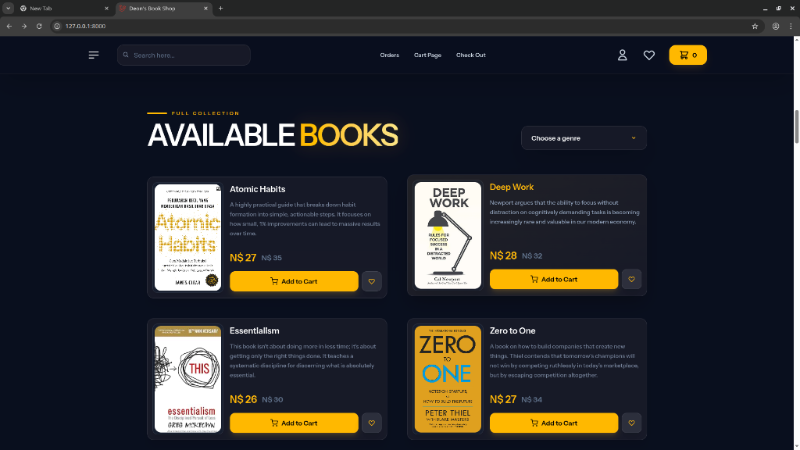
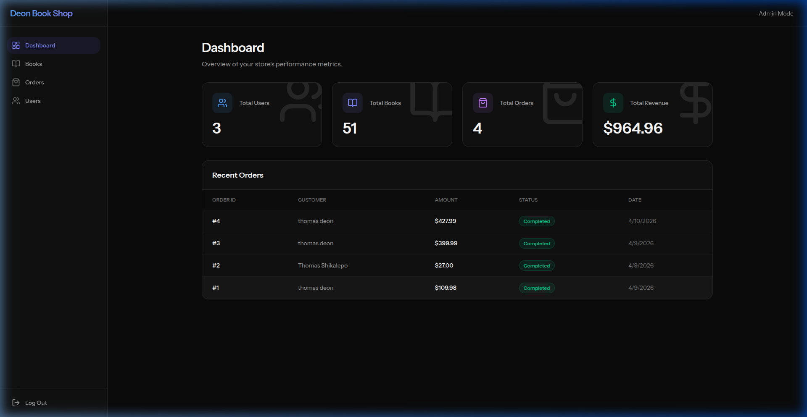
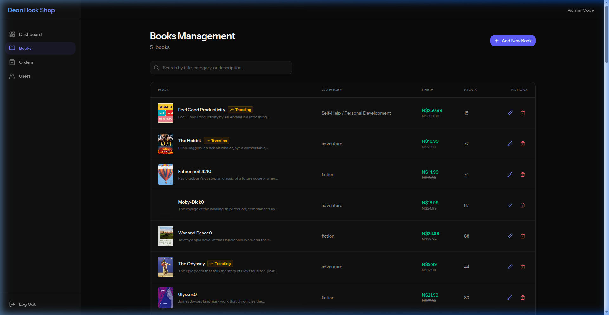
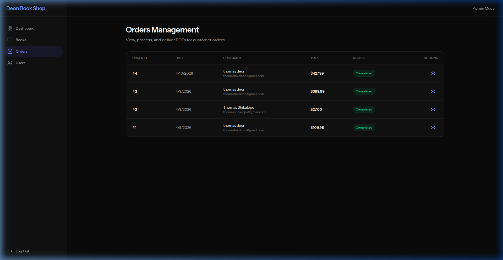
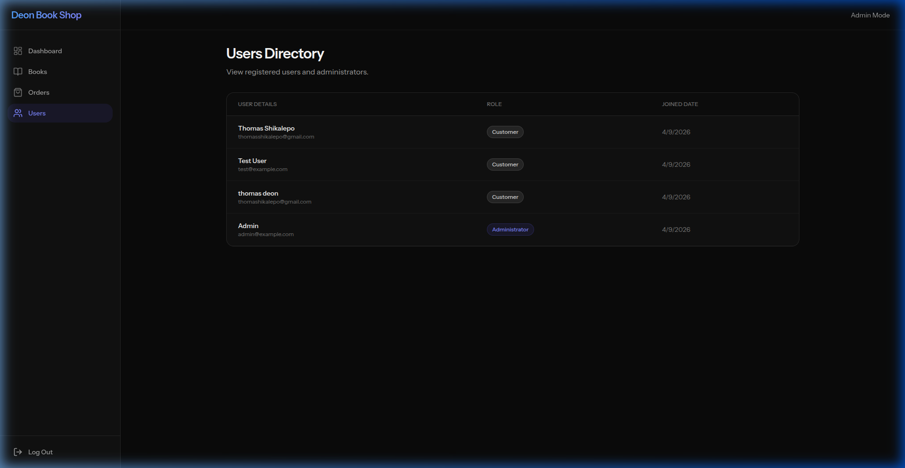

# 📚 Deon's Book Shop: The Midnight Library

Welcome to the **Midnight Library** — an elegant, dark-themed online bookshop born out of a simple pursuit: **to make discovering your next great read feel as magical as the stories themselves.** 

Long gone are the days of scrolling through generic, stark-white e-commerce grids. We created the Midnight Library for the night owls, the dreamers, and the avid readers who want a digital space that respects the solitary, focused ritual of reading. With ambient glows, tactile animations, and zero page-reloads, this isn’t just a store—it’s an experience. 🌙


## ✨ Features

## 📸 A Glimpse Inside

### The Ambient Home & Catalog
A captivating hero section greeting readers with the latest releases, transitioning smoothly into a curated catalog of available books.



### The Portal (Authentication)
A sleek, focused login and registration flow keeping with the dark aesthetic.


---

## 🛡 The Command Center (Admin)

Running a library is serious business. The fully functional Admin Dashboard provides real-time metrics and deep management capabilities over every aspect of the store.

### Overview Dashboard
Get a bird's eye view of revenue, active orders, and essential store statistics.


### Inventory Management (Books)
Easily add, edit, or remove titles from the collection.


### Order Tracking
Keep tabs on what books are being shipped to readers.


### User Administration
Manage the community of readers with ease.


---

## 🛠 Tech Stack

Built on the bleeding edge of modern web development:

- **Backend**: [Laravel 13](https://laravel.com/) — The robust, elegant PHP framework.
- **State & Routing**: [Inertia.js](https://inertiajs.com/) v3 — The modern monolith approach for a flawless SPA experience.
- **Frontend**: [React 19](https://react.dev/) — For building responsive, interactive user interfaces.
- **Styling**: [Tailwind CSS v4](https://tailwindcss.com/) — Utility-first styling for our custom Midnight aesthetic.
- **UI Architecture**: [Radix UI](https://www.radix-ui.com/) (Headless Primitives) + custom tailored components.
- **Animations**: [Framer Motion](https://www.framer.com/motion/) — Fluid, physics-based animations.
- **Database**: SQLite (Ready to swap to PostgreSQL/MySQL).

---

## 🚀 Getting Started

Ready to run your own Midnight Library locally? Follow these steps:

### Prerequisites
Make sure you have the following installed on your machine:
- PHP >= 8.3
- Composer
- Node.js (v20+ recommended) & npm
- Git

### Installation

1. **Clone the repository**
   ```bash
   git clone <your-repo-url>
   cd online_book_shop
   ```

2. **Install PHP dependencies**
   ```bash
   composer install
   ```

3. **Install JavaScript dependencies**
   ```bash
   npm install
   ```

4. **Environment Setup**
   Copy the example `.env` file and generate an application key:
   ```bash
   cp .env.example .env
   php artisan key:generate
   ```

5. **Database Setup**
   Run the database migrations and seeders (this sets up the required tables and populates your shop with some books and a default admin user!).
   ```bash
   php artisan migrate:fresh --seed
   ```

6. **Fire it up 🔥**
   You can run both the frontend and backend simultaneously using the convenient dev script:
   ```bash
   composer run dev
   ```
   *(Alternatively, run `php artisan serve` and `npm run dev` in separate terminal windows).*

Visit **`http://localhost:8000`** in your browser and step into the Midnight Library. Use the following credentials to access the Command Center:
- **Email:** `admin@example.com`
- **Password:** `password`

---

## 👨‍💻 Contributing

Whether it's a new feature, a bug fix, or a design tweak, contributions are welcome! Simply fork the repo, create your feature branch, and open a Pull Request.

---

Enjoy your literary adventure! 📖✨
