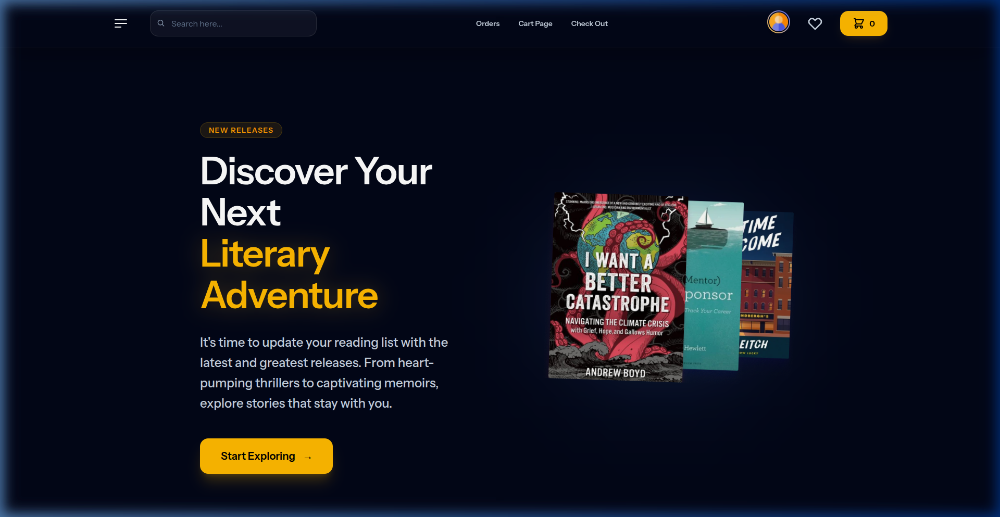
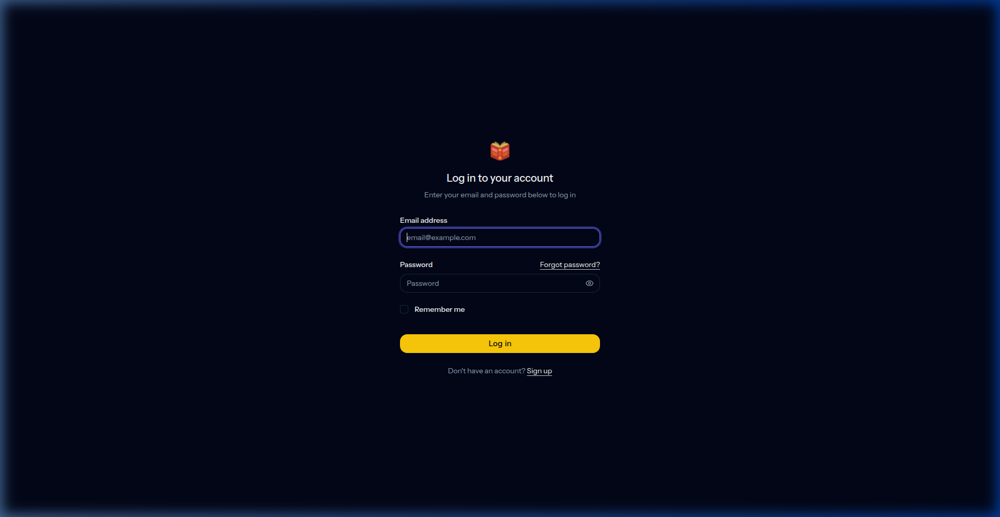
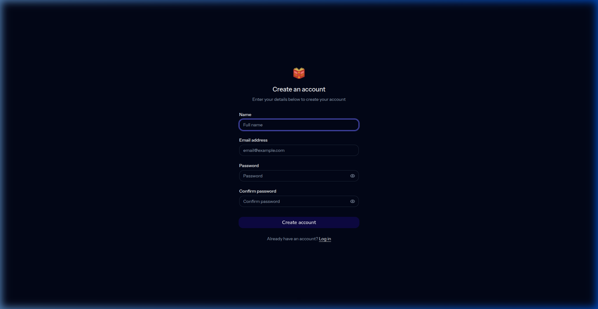

# 📚 Deon's Book Shop: The Midnight Library

Welcome to the **Midnight Library** — an elegant, dark-themed online bookshop built for the modern reader. This isn't just an e-commerce platform; it's a curated digital reading experience that pairs an ambient, premium aesthetic with lightning-fast performance.

Prepare to browse, wish, and checkout in style. 🌙

---

## ✨ Features

- **The "Midnight Library" Aesthetic**: A meticulously crafted dark mode UI with ambient amber/gold glows, smooth gradients, and glassmorphic elements. 
- **Fluid Micro-Interactions**: Powered by Framer Motion, every hover, scroll, and click feels alive, delivering a tactile browsing experience.
- **Dynamic Book Discovery**: Easily browse "Top Sellers", search the collection, or explore "Recommended Books".
- **Wishlist & Cart Management**: Save books for later, auto-sync between wishlist and cart, and enjoy a seamless checkout flow.
- **Admin Command Center**: A fully isolated, secure, and mobile-optimized dashboard for managing users, book inventory, and orders.
- **Single Page Application (SPA) Speed**: No page reloads here. Blazing fast transitions courtesy of Inertia.js.

---

## 📸 A Glimpse Inside

### The Ambient Home Experience
A captivating hero section greeting readers with the latest releases and an immersive cinematic design.


### The Portal (Authentication)
A sleek, focused login and registration flow keeping with the dark aesthetic.



*(Note: These are just a taste. Fire up the app to explore the dynamic Book Cards, Cart Page, and the Admin Dashboard!)*

---

## 🛠 Tech Stack

Built on the bleeding edge of modern web development:

- **Backend**: [Laravel 13](https://laravel.com/) — The robust, elegant PHP framework.
- **State & Routing**: [Inertia.js](https://inertiajs.com/) v3 — The modern monolith approach for a flawless SPA experience.
- **Frontend**: [React 19](https://react.dev/) — For building responsive, interactive user interfaces.
- **Styling**: [Tailwind CSS v4](https://tailwindcss.com/) — Utility-first styling for our custom Midnight aesthetic.
- **UI Architecture**: [Radix UI](https://www.radix-ui.com/) (Headless Primitives) + custom tailored components.
- **Animations**: [Framer Motion](https://www.framer.com/motion/) — Fluid, physics-based animations.
- **Database**: SQLite (Ready to swap to PostgreSQL/MySQL).

---

## 🚀 Getting Started

Ready to run your own Midnight Library locally? Follow these steps:

### Prerequisites
Make sure you have the following installed on your machine:
- PHP >= 8.3
- Composer
- Node.js (v20+ recommended) & npm
- Git

### Installation

1. **Clone the repository**
   ```bash
   git clone <your-repo-url>
   cd online_book_shop
   ```

2. **Install PHP dependencies**
   ```bash
   composer install
   ```

3. **Install JavaScript dependencies**
   ```bash
   npm install
   ```

4. **Environment Setup**
   Copy the example `.env` file and generate an application key:
   ```bash
   cp .env.example .env
   php artisan key:generate
   ```

5. **Database Setup**
   Run the database migrations and seeders (this sets up the required tables and populates your shop with some books and a default admin user!).
   ```bash
   php artisan migrate:fresh --seed
   ```

6. **Fire it up 🔥**
   You can run both the frontend and backend simultaneously using the convenient dev script:
   ```bash
   composer run dev
   ```
   *(Alternatively, run `php artisan serve` and `npm run dev` in separate terminal windows).*

Visit **`http://localhost:8000`** in your browser and step into the Midnight Library.

---

## 👨‍💻 Contributing

Whether it's a new feature, a bug fix, or a design tweak, contributions are welcome! Simply fork the repo, create your feature branch, and open a Pull Request.

---

Enjoy your literary adventure! 📖✨
